<div align="center">
  <h1>Library Website</h1>
</div>

<!-- Table of Contents -->

## :notebook_with_decorative_cover: Table of Contents

- [Introduction](#introduction)
- [Features](#dart-features)
  - [Login](#closed_lock_with_key-login)
  - [Register](#pencil-register)
  - [Search](#mag-search)
  - [Reserve](#notebook-reserve)
  - [Sign Out](#door-sign-out)
- [Getting Started](#toolbox-getting-started)
- [Screenshots](#camera-screenshots)
  - [Home Page](#one-home-page)
  - [Login](#two-login)
  - [Register](#three-register)
  - [Account Overview](#four-account-overview)
  - [Search](#five-search)
  - [Reserve](#six-reserve)
  - [Sign Out](#seven-sign-out)
- [System Design](#triangular_ruler-system-design)
  - [Wireframes](#pencil-wireframes)
  - [Logo](#black_square_button-logo)
  - [Colour Scheme](#art-colour-scheme)
  - [Database](#cd-database)
- [Directory Structure](#file_folder-directory-structure)

---

<!-- Features -->

## Introduction

Developed a book reservation website that will allow users to manage their account, search for and reserve library books. The technology stack utilised in this website are PHP, MySQL, HTML & CSS.

---

<!-- Features -->

## :dart: Features

### :closed_lock_with_key: Login

- Users can login using session identifications
- Login details are verified against saved information in the database for registered user

### :pencil: Register

Validation of user registration includes:

- Usernames must be unique, no duplicate usernames can exist in the database
- Passwords must be minimum 6 characters long & must be entered twice to confirm that masked password is correct in both entries
- Mobile phone numbers must be 10 characters long and numeric only

### :mag: Search

Users can search (partial or full) filter for a book by:

- Author
- Title
- Author and Title
- Category

The details of each book are displayed including:

- ISBN
- Book Title
- Author
- Edition
- Year
- Reservation Status

### :notebook: Reserve

- User can reserve a book if not reserved by another user
- View list of all books reserved
- Delete reserve book from account

### :door: Sign Out

Terminates the user's session so that nobody can access their account information. Once logged out, a user must login again to access the website.

---

<!-- Getting Started -->

## :toolbox: Getting Started

**To set up the database:**

1. On XAMPP Control Panel, start **Apache** and **MySQL**
2. On your browser, type the following command on your browser address:

   ```bash
   http://localhost/phpmyadmin/
   ```

3. Go to **_"Import"_** --> **_"Choose File"_** and upload the sql file named **_"novella.sql"_**

**To set up the website:**

1. On your local machine, Locate `"xampp/htdocs"` and add the folder **_"Code"_** to the directory
2. To **run the website**, type the following command on your browser address:

   ```bash
   http://localhost/Code/
   ```

---

<!-- System Design -->

## :camera: Screenshots

### :one: Home Page

#### Not Signed in

<div align="center"> 
    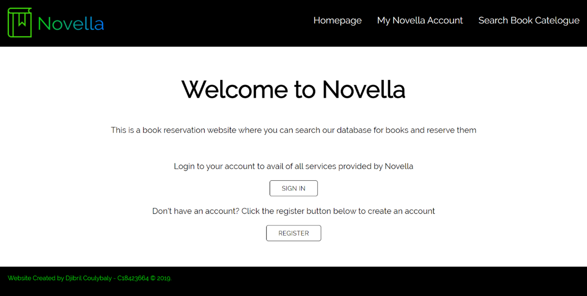
</div>

#### Signed in

<div align="center"> 
    
</div>

### :two: Login

<div align="center"> 
    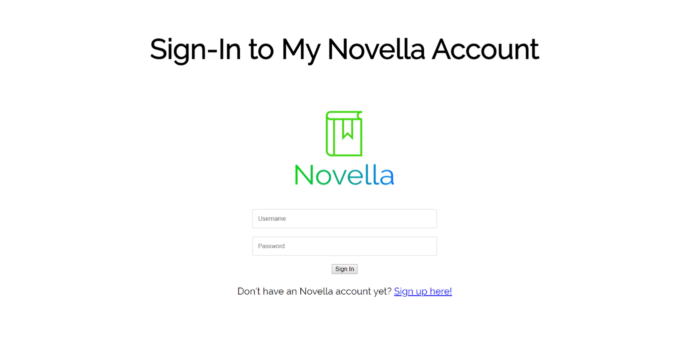
</div>

### :three: Register

<div align="center"> 
    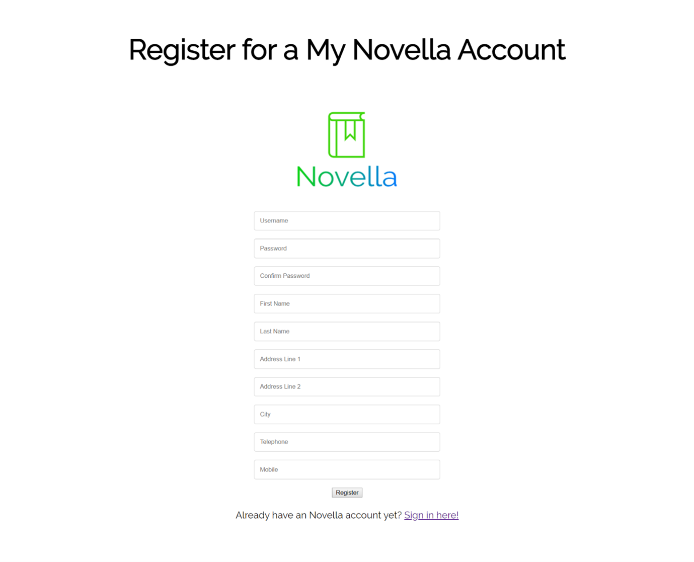
</div>

### :four: Account Overview

<div align="center"> 
    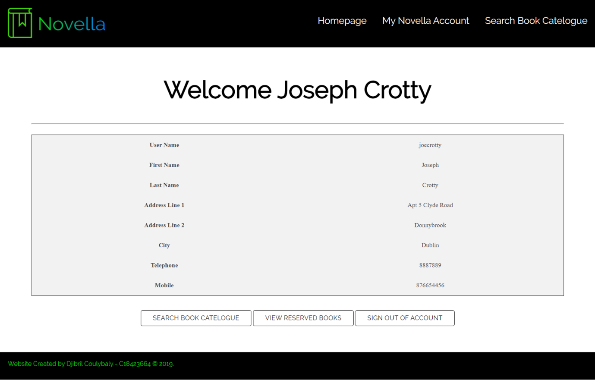
</div>

### :five: Search

#### Filter Search

<div align="center"> 
    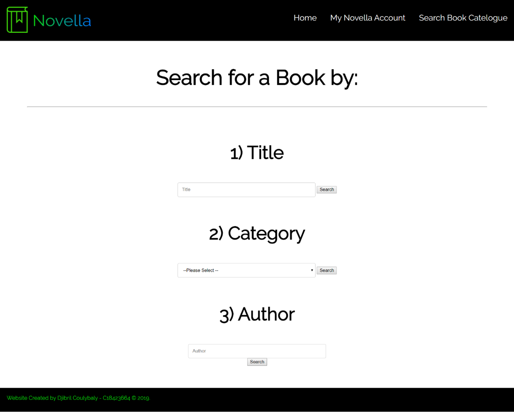
</div>

#### Results

<div align="center"> 
    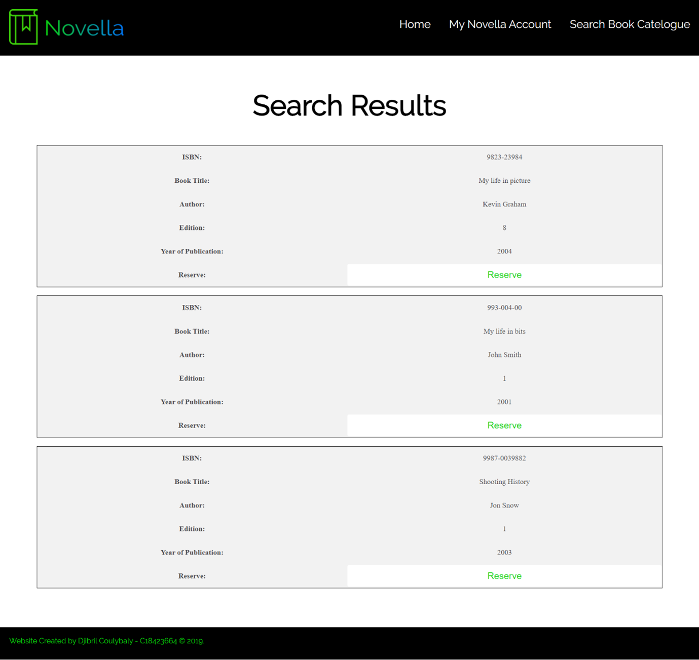
</div>

### :six: Reserve

#### Logged in

<div align="center"> 
    
</div>

#### Not logged in

<div align="center"> 
    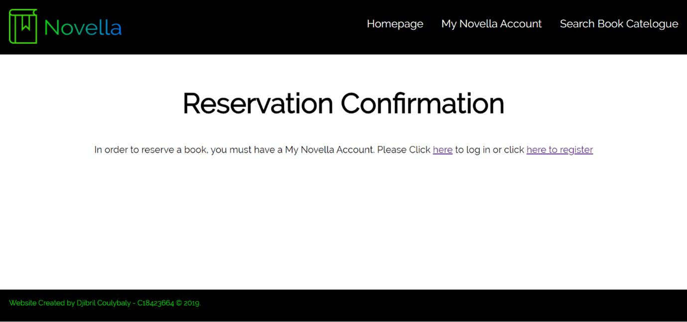
</div>

#### Viewing Reservation

<div align="center"> 
    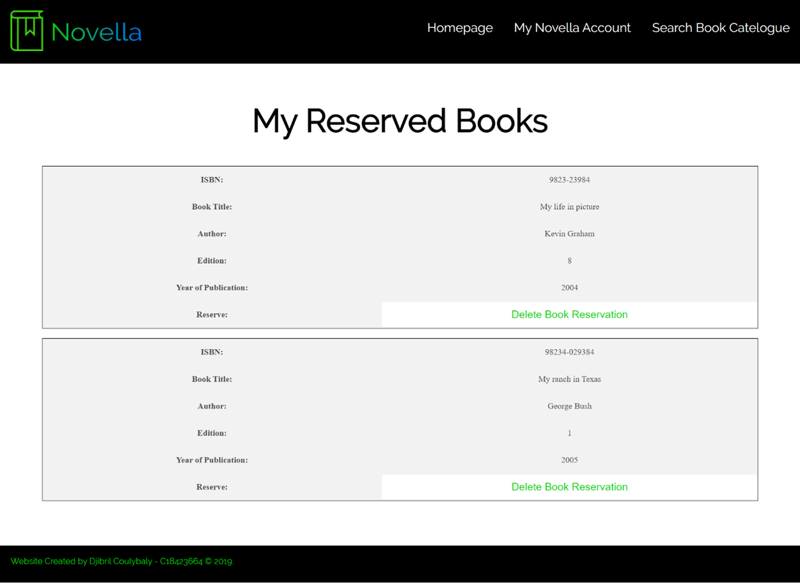
</div>

#### Delete Reservation

<div align="center"> 
    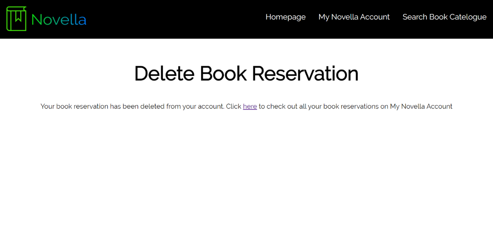
</div>

### :seven: Sign Out

<div align="center"> 
    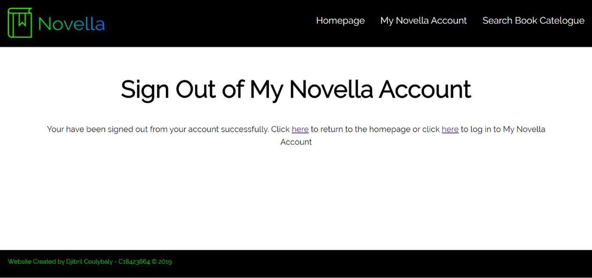
</div>

---

<!-- System Design -->

## :triangular_ruler: System Design

### :pencil: Wireframes

I then made some wireframes or Low Fidelity Prototype to visualise how the website will come to exist. Using the website www.wireframe.cc, I designed the website layouts as shown:

<div align="center"> 
    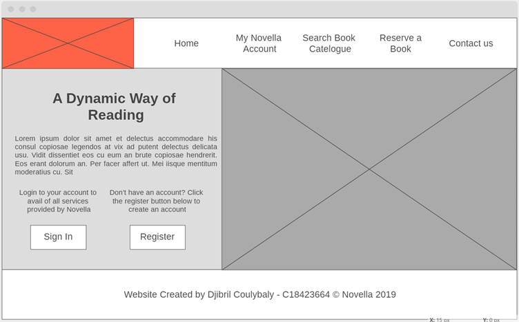
    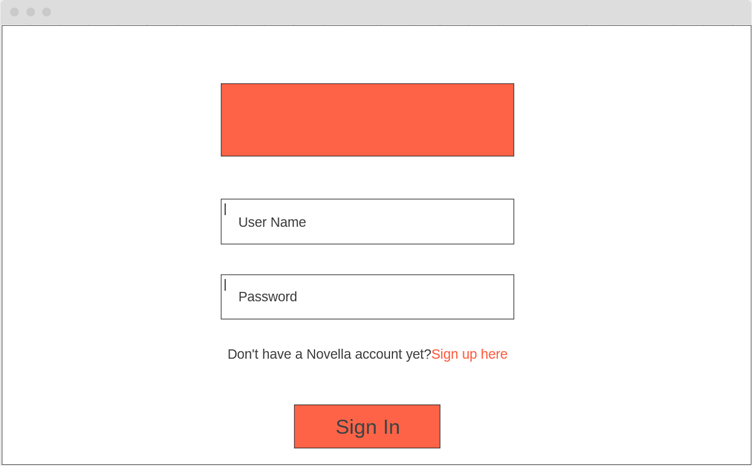
    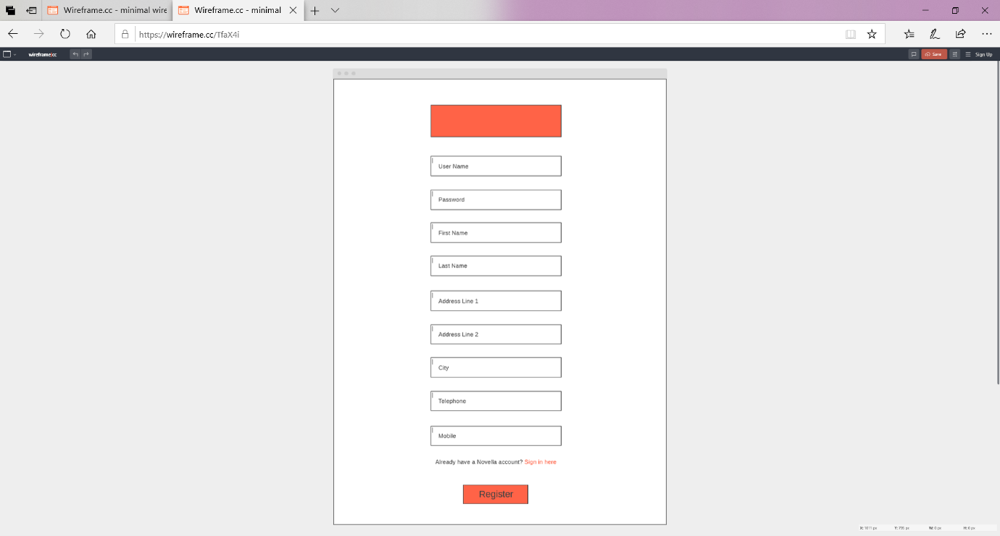
    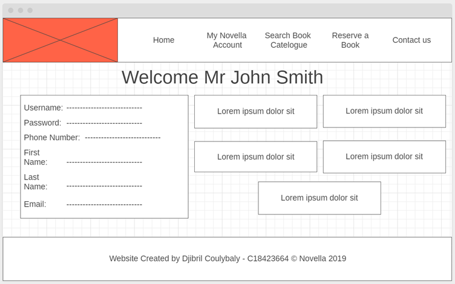
</div>

### :black_square_button: Logo

The logo was created using https://designapp.io/app.

| Hex                                                                                                                                            | Result                                                          |
| ---------------------------------------------------------------------------------------------------------------------------------------------- | --------------------------------------------------------------- |
|  #0cd316 </br> #017bf8 |  |

### :art: Colour Scheme

| Color            | Hex                                                                  |
| ---------------- | -------------------------------------------------------------------- |
| Primary Color    |  #000000 |
| Background Color |  #FFFFFF |
| Accent Color     |  #0CD60E |
| Text Color       |  #000000 |

### :cd: Database

The following tables were created for the database:

#### :one: Users Table

Stores user registration and password details. Each user is uniquely identified by a user name.

| UserName     | Password | FirstName | LastName | AddressLine1     | AddressLine2 | City   | Telephone | Mobile    |
| ------------ | -------- | --------- | -------- | ---------------- | ------------ | ------ | --------- | --------- |
| alanjmckenna | t1234s   | Alan      | McKenna  | 38 Cranley Road  | Fairview     | Dublin | 9998377   | 856625567 |
| joecrotty    | kj7899   | Joseph    | Crotty   | Apt 5 Clyde Road | Donnybrook   | Dublin | 8887889   | 876654456 |
| tommy100     | 123456   | tom       | behan    | 14 Hyde Road     | dalkey       | dublin | 9983747   | 876738782 |

#### :two: Books Table

Storing all book details, indexed by ISBN number

| ISBN         | BookTitle                | Author           | Edition | Year | Category | Reserved |
| ------------ | ------------------------ | ---------------- | ------- | ---- | -------- | -------- |
| 093-403992   | Computers in Business    | Alicia Oneill    | 3       | 1997 | 003      | N        |
| 23472-8729   | Exploring Peru           | Stephanie Birchi | 4       | 2005 | 005      | N        |
| 237-34823    | Business Strategy        | Joe Peppard      | 2       | 2002 | 002      | N        |
| 23u8-923849  | A guide to nutrition     | John Thorpe      | 2       | 1997 | 001      | N        |
| 2983-3494    | Cooking for children     | Anabelle Sharpe  | 1       | 2003 | 007      | N        |
| 82n8-308     | Computers for idiots     | Susan O'Neill    | 5       | 1998 | 004      | N        |
| 9823-23984   | My life in picture       | Kevin Graham     | 8       | 2004 | 001      | N        |
| 9823-2403-0  | DaVinci Code             | Dan Brown        | 1       | 2003 | 008      | N        |
| 9823-98345   | How to cook Italian food | Jamie Oliver     | 2       | 2005 | 007      | Y        |
| 9823-98487   | Optimising your business | Cleo Blair       | 1       | 2001 | 002      | N        |
| 98234-029384 | My ranch in Texas        | George Bush      | 1       | 2005 | 007      | Y        |
| 988745-234   | Tara Road                | Maeve Binchy     | 4       | 2002 | 008      | N        |
| 993-004-00   | My life in bits          | John Smith       | 1       | 2001 | 001      | N        |
| 9987-0039882 | Shooting History         | Jon Snow         | 1       | 2003 | 001      | N        |

#### :three: Category Table

Indicating the list of book categories (fiction, business etc). It is linked to the Books table by category code

| CategoryID | CategoryDescription |
| ---------- | ------------------- |
| 001        | Health              |
| 002        | Business            |
| 003        | Biography           |
| 004        | Technology          |
| 005        | Travel              |
| 006        | Self-Help           |
| 007        | Cookery             |
| 008        | Fiction             |

#### :four: Reserved Books Table

Holding a list of books reserved by the user (identified by username). It is linked to the books table by ISBN number and the Users table by username.

| ISBN         | UserName  | ReservedDate |
| ------------ | --------- | ------------ |
| 9823-98345   | tommy100  | 2008-10-11   |
| 98234-029384 | joecrotty | 2008-10-11   |

---

<!-- Directory Structure -->

## :file_folder: Directory Structure

```
|-- Code
|   |-- Assets
|   |   |-- CSS
|   |   |   '-- site.css
|   |   |-- Images
|   |   |   |-- my_logo.png
|   |   |   '-- novella_logo.png
|   |-- account.php
|   |-- accountReservedBook.php
|   |-- authentication.php
|   |-- db.php
|   |-- delete.php
|   |-- index.php
|   |-- login.html
|   |-- novella.sql
|   |-- register.php
|   |-- reserve.php
|   |-- search.php
|   |-- searchResults.php
|   '-- signout.php
```
